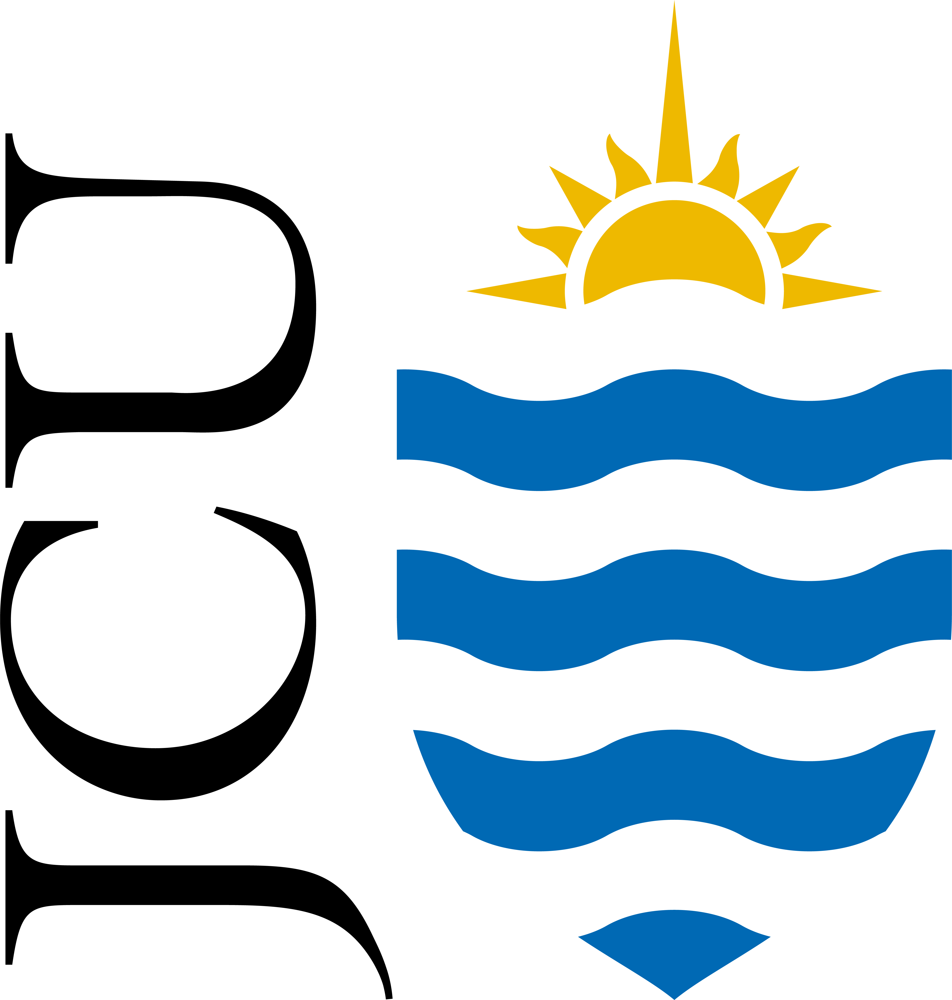
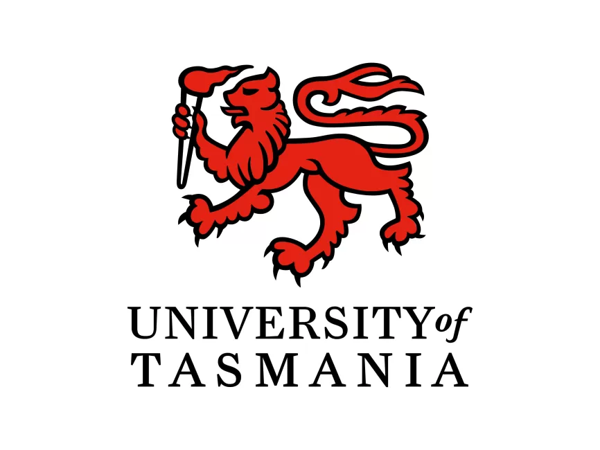

# Stochastic epidemiological models to test the origin and demographic impact of smallpox on Aboriginal Australians in the 18<supth Century

## Focal manuscript
<a href="https://au.linkedin.com/in/alan-williams-7973a958">Williams, AN</a>, <a href="https://evolutionofculturaldiversity.anu.edu.au/our-people/ray-tobler/">R Tobler</a>, <a href="https://experts.deakin.edu.au/42085-billy-griffiths">B Griffiths</a>, <a href="https://portfolio.jcu.edu.au/researchers/sean.ulm/">S Ulm</a>, <a href="https://www.flinders.edu.au/people/cody.nitschke">MC Nitschke</a>, <a href="https://portfolio.jcu.edu.au/researchers/michael.bird">MI Bird</a>, <a href="https://scholars.uow.edu.au/shane-ingrey">S Ingrey</a>, <a href="https://www.flinders.edu.au/people/frederik.saltre">F Saltré</a>, <a href="https://www.facebook.com/profile.php?id=100076324899510">K Beller</a>, <a href="https://research.monash.edu/en/persons/ian-mcniven">IJ McNiven</a>, <a href="https://au.linkedin.com/in/nick-pitt-772440ba">N Pitt</a>, <a href="https://research.monash.edu/en/persons/lynette-russell-am">L Russell</a>, <a href="https://discover.utas.edu.au/Christopher.Wilson">C Wilson</a>, <a href="https://www.flinders.edu.au/people/corey.bradshaw">CJA Bradshaw</a>. <a href="">Large size of the Australian Indigenous population prior to its massive decline following European invasion</a>. In review

## Abstract
Estimating the size of Indigenous (Aboriginal) populations in Australia prior to the impact of European colonial invasion is essential to truth-telling and reconciliation, as well as providing a baseline from which to anchor contemporary socio-economic and environmental management. Robust estimates of the population dynamics of pre-colonial Indigenous Australians are poor due to the early exposure to lethal diseases, extensive frontier violence, and a lack of any systematic censuses. Here we review ethnographic observations, archaeological and genetic reconstructions, and modelled carrying capacity using climate hindcasts, to infer Indigenous population size prior to colonial invasion. This allows us to estimate the number of excess deaths in post-colonial times. Congruency of the modelled (not reconstructions based on historical accounts) population size estimates suggests a bootstrapped median of 2.51 million people in the pre-colonial population (75% confidence interval: 1.13–4.41 million), or 0.33 people km-2 (75% confidence interval: 0.15–0.57 km-2). For a median pre-colonial population of 2.51 million, approximately 32,500 excess deaths year-1 (2.39 million deaths in total) would have had to occur over the late 18th and early 19th Centuries from colonial invasion-related mortality to arrive at the estimated population of 0.177–0.193 million by 1861 (i.e., to 7–8% of the median pre-colonial population). These findings highlight the major impacts of invasion experienced by Indigenous Australians, and demonstrate a remarkable story of survival, resilience, and recovery over the past 235 years. However, even today, the Indigenous population remains at only ~ one-third of its median pre-colonial size, with parity to pre-invasion numbers only likely to be achieved by 2050 at the current rate of increase.

## <a href="https://github.com/cjabradshaw/AusIndigN/tree/main/scripts">Scripts</a>
R code by Corey Bradshaw (<a href="http://github.com/cjabradshaw">@cjabradshaw</a>)

### <a href="https://github.com/cjabradshaw/AusIndigN/tree/main/scripts">base script</a>
- <code>indigN.R</code>: includes all code used to derive estimates reported in the paper mentioned above

### <a href="https://github.com/cjabradshaw/AusIndigN/tree/main/scripts/source">source functions</a>
- <code>matrixOperators.r</code>: functions for manipulating matrices for population projections
- <code>new_lmer_AIC_tables3.r</code>: functions to calculate information-theoretic parameters for linear models
- <code>r.squared.r</code>: functions to calculate goodness of fit for linear models

## <a href="https://github.com/cjabradshaw/AusIndigN/tree/main/data">Data</a>
- <em>NppSahul(0-140ka_rawvalues)_Krapp2021.csv.zip</em>: hindcasted net primary production (kg C m-2 year-1) for 0.5°×0.5° grid cells from 140 ka to the present for Sahul from <a href="http://doi.org/10.1038/s41597-021-01009-3">Krapp et al. (2000)</a> (unzip .csv file first)
- <em>world2013lifetable.csv</em>: age-specific human life-table values from <a href="http://doi.org/10.1073/pnas.1410465111">Bradshaw & Brook (2014)</a>
- <em>bindensModelOverlay.csv</em>: population estimates from <a href="https://www.ucpress.edu/books/constructing-frames-of-reference/paper">Binford (2001)</a> using R package <code>binford</code> (<a href="http://CRAN.R-project.org/package=binford">Marwick et al. 2016</a>) overlayed on carrying-capacity estimates

## R libraries
<code>sp</code>, <code>raster</code>, <code>oceanmap</code>, <code>OceanView</code>, <code>abind</code>, <code>pracma</code>, <code>binford</code>, <code>rgl</code>, <code>scatterplot3d</code>, <code>spatstat</code>, <code>spatialEco</code>, <code>SpatialPack</code>, <code>performance</code>, <code>sjPlot</code>, <code>dismo</code>, <code>gbm</code>, <code>truncnorm</code>, <code>bootstrap</code>

### Acknowledgements
The authors acknowledge the sovereign Traditional Owners and custodians (First Nations) of the unceded lands and seas where we live and work, including <a href="https://www.gujaga.org.au/faq">Bidiagal</a> in Sydney (A.N.W., N.P.), <a href="https://www.sutherlandshire.nsw.gov.au/play-and-explore/local-history-and-heritage/local-history">Dharawal</a> in Kamay/Botany Bay (K.B., S.I.), <a href="https://www.sutherlandshire.nsw.gov.au/play-and-explore/local-history-and-heritage/local-history">Dharawal</a> in Woolungah/Wollongong (F.S.), <a href="https://www.melbourne.vic.gov.au/aboriginal-melbourne">Kulin</a> Nation in Naarm/Melbourne (B.G., I.J.M., L.R.), <a href="https://dawulwuru.com.au/">Yirrganydji</a> and <a href="https://www.yidinji.com/">Gimuy Walubara Yidinji</a> in Gimuy/Cairns (S.U., M.I.B.), <a href="https://www.ngunnawal.org/who-we-are">Ngunnawal</a> and <a href="https://www.nma.gov.au/learn/encounters-education/community-stories/canberra">Ngambri</a> in Galambary/Canberra (R.T.), <a href="https://ngarrindjeri.com.au/">Ngarrindjeri</a> of Murrundi/lower Murray River, Kurangk/Coorong, and eastern Fleurieu Peninsula (C.W.), <a href="https://tacinc.com.au/">Palawa</a> in Nipaluna/Hobart, lutruwitra/Tasmania (C.W.), <a href="https://www.kaurnawarra.org.au/kaurna-people">Kaurna</a> in Tarndanya/Adelaide (C.J.A.B., M.C.N., F.S.), and <a href="https://www.facebook.com/peramangkgovernancecouncil/">Peramangk</a> in Bukatila/Mount Lofty Ranges (C.J.A.B.). The authors also acknowledge and recognise the deep historical and cultural harm our truth-telling exposes, and we commiserate sincerely with all First Nations peoples of Australia.

### Funding
Funded jointly by the <a href="http://www.arc.gov.au">Australian Research Council</a> <a href="http://ciehf.au">Centre of Excellence for Indigenous and Environmental Histories and Futures</a> (CE230100009), and the <a href="http://www.arc.gov.au">Australian Research Council</a> <a href="http://epicaustralia.org.au">Centre of Excellence for Australian Biodiversity and Heritage</a> (CE17010001). L.R. supported by an <a href="http://www.arc.gov.au">Australian Research Council</a> Laureate Fellowship (FL190100161). B.G. supported by an <a href="http://www.arc.gov.au">Australian Research Council</a> Discovery Early Career Researcher Award (DE220100203). 
 

    &nbsp;  &nbsp;  &nbsp;  &nbsp;  &nbsp;  

